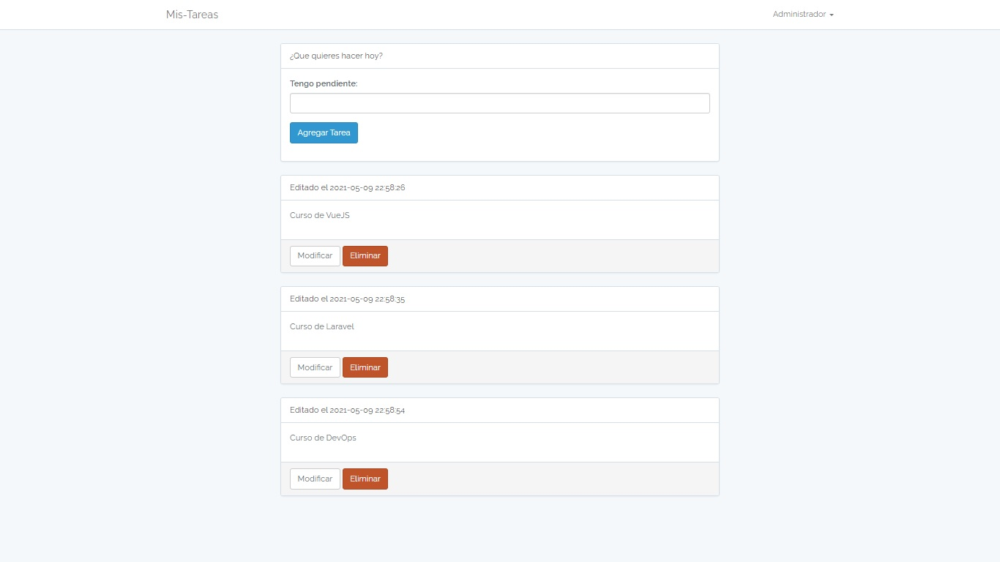

#Aplicación para agregar un listado de tareas sencillo. realizada en Laravel 5.5 y VueJS
- Creada el 20/06/2020 
- Para ejecutar el proyecto se debe ejecutar el comando: composer install o composer update para que descargue las dependencias.
- Luego hay que crear la BD.
- Luego ejecutar las migraciones con el comando: php artisan make:migrate. Tambien cuenta con un usuario predefinido el cual es:

name: Administrador
email: admin@panel.com
password: admin

- Para llenar este dato en BD se debe ejecutar el comando: php artisan db:seed
- Luego generar la key con el comando: php artisan key:generate

- Ejemplo:

